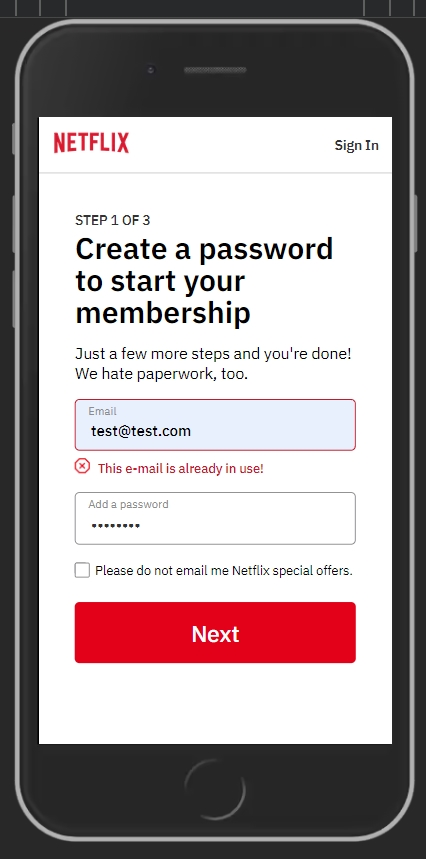

<h1>Netflix clone</h1>

I would like to share with you my Netflix clone project, built using Next.js with a touch of React Redux, Firebase, and TypeScript. The app is fully responsive, working seamlessly on mobiles, tablets, and desktops. It mimics the Netflix experience with the TMDB database, though it’s less detailed—meaning no videos or in-depth episode info. The project includes numerous sub-pages, from the main view to login/registration, profile selection and editing, plus dedicated pages for series, movies, and individual titles. Since it’s not a pixel-perfect clone, I’ve used unique icons, dummy text, and a vertical layout for posters, adapting to TMDB’s API differences compared to Netflix’s horizontal design.

Check out the live demo hosted on Vercel: <a href='https://netflixcloneen.vercel.app'>Netflix Clone</a>

<h2>📫 Project contains</h2>

<ul>
  <li>Main pages for guests and logged-in users (slight tweaks for kids, same API data)</li>
  <li>About 30 sub-pages, including dynamic ones with series and movie data</li>
  <li>Full Netflix-style registration with device, language, and series selection</li>
  <li>User authentication (login, logout, registration, and sign-in)</li>
  <li>Series and movie search by title</li>
  <li>Extra features for logged-in users (profile editing, "watching series", browse/kids pages)</li>
  <li>Using firebase to log in / log out and auth management</li>
  <li>Firebase-powered login, logout, and authentication management</li>
  <li>Accessibility-friendly practices</li>
  <li>SEO-optimized structure</li>
  <li>Adherence to core design principles</li>
  <li>Custom 404 and 500 pages</li>
</ul>

<h2>🛠 Tools and Technologies</h2>

<ul>
  <li>React</li>
  <li>React Redux</li>
  <li>Next.js</li>
  <li>TypeScript</li>
  <li>JavaScript</li>
  <li>Firebase</li>
  <li>Git / GitHub</li>
</ul>

 
 
 
 
 

